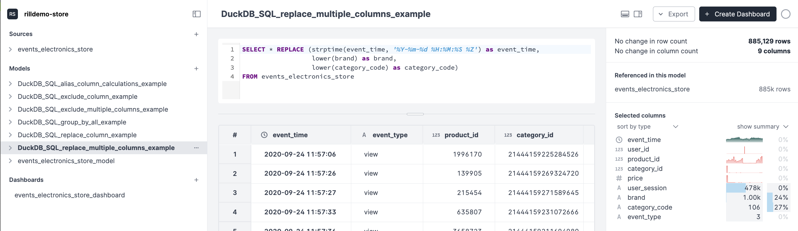

# rilldemo-duckdb-sql

This is a demo project designed to illustrate how Rill can be used for use cases in programmatic advertising.

rill version 0.23.1

## How to clone and run this demo project

* First download Rill

```
curl -s https://cdn.rilldata.com/install.sh | bash
```

* Then start Rill with this project's code

```
rill start https://github.com/medriscoll/rilldemo-duckdb-sql.git
```

Rill will rehydrate the data sources and then launch in a new browser window. 



